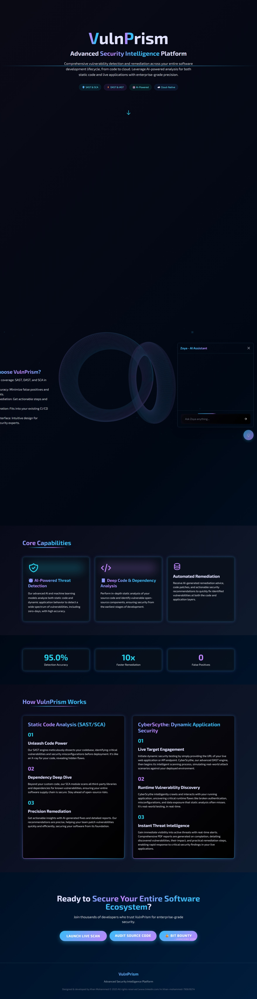
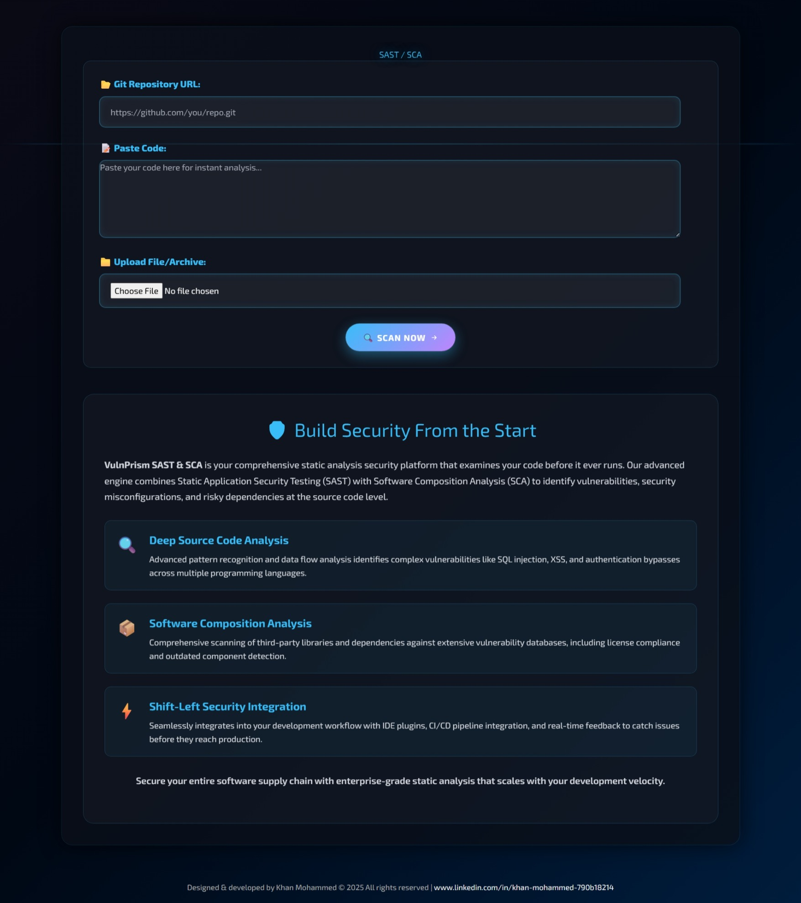
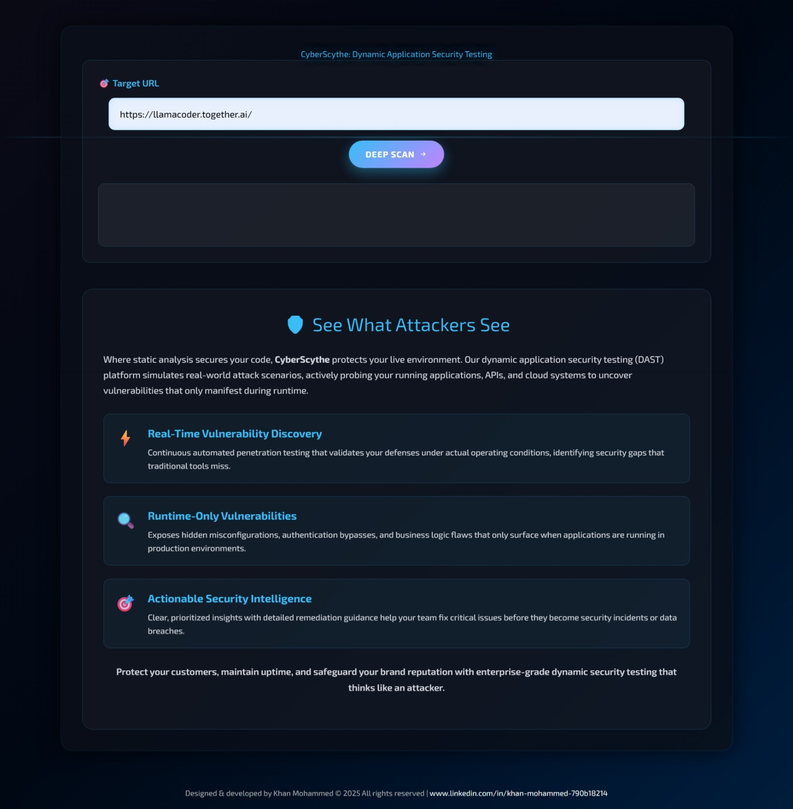

# VulnPrism: Advanced Security Intelligence Platform

VulnPrism is a comprehensive, cloud-native security intelligence platform designed to integrate seamlessly into the DevSecOps lifecycle. It provides a unified solution for Static Application Security Testing (SAST), Software Composition Analysis (SCA), and Dynamic Application Security Testing (DAST), empowering developers and security teams to build and maintain secure applications with confidence.

## Core Features

-   **Unified Security Dashboard:** A single, intuitive interface built with React for accessing all security tools and insights.
-   **SAST & SCA Engine:** Performs deep analysis of source code and dependencies using a powerful combination of tools like Semgrep, Bandit, Trivy, Gitleaks, and OWASP Dependency-Check. It can scan Git repositories, local files, or pasted code snippets.
-   **DAST Engine (CyberScythe):** A dynamic scanner that actively probes running web applications and APIs for runtime vulnerabilities, simulating real-world attack scenarios.
-   **AI Assistant (Zoya):** An integrated chatbot powered by the DeepSeek API, providing real-time cybersecurity guidance and analysis assistance.
-   **Automated CI/CD:** Includes pre-configured Jenkins pipelines for a full CI/CD workflow, from code scanning and image building to automated deployment.
-   **Cloud-Native & Scalable:** Fully containerized with Docker and architected for scalable deployments on Kubernetes using a production-ready Helm chart.

## Screenshots

### Main Dashboard


### SAST Service Interface


### CyberScythe (DAST) Service Interface



## Architecture Overview

VulnPrism is composed of three core microservices that work together to provide a comprehensive security solution.

```
+----------------------------------------------------------------+
|                           User / Developer                     |
+----------------------------------------------------------------+
       |                                  ^
       | (Interacts with UIs)             | (Receives Reports)
       v                                  |
+----------------------------------------------------------------+
| Ingress (NGINX on Kubernetes) / Direct Port (Docker Compose)   |
+----------------------------------------------------------------+
       |                      |                      |
       |                      |                      |
+------v-------------+  +-----v--------------+  +-----v-------------+
| chatbot-frontend   |  | sast               |  | cyberscythe       |
| (Port 3000)        |  | (Port 5050)        |  | (Port 5051)       |
| - Main Dashboard   |  | - SAST/SCA Scans   |  | - DAST Scans      |
| - React UI         |  | - Reporting        |  | - Reporting       |
| - Zoya AI Chatbot  |  |                    |  |                   |
+--------------------+  +--------------------+  +-------------------+
       |
       | (Proxies to)
       v
+--------------------+
| DeepSeek API       |
+--------------------+
```

## Tech Stack

| Category                  | Technologies                                                                                             |
| ------------------------- | -------------------------------------------------------------------------------------------------------- |
| **Frontend**              | React, Tailwind CSS, Three.js, GSAP                                                                      |
| **Backend**               | Python, FastAPI, Uvicorn                                                                                 |
| **Security Tools (SAST)** | Semgrep, Bandit, Trivy, Gitleaks, OWASP Dependency-Check, pip-audit                                        |
| **Security Tools (DAST)** | Playwright, httpx, selectolax                                                                            |
| **CI/CD**                 | Jenkins (Groovy Pipelines), Docker, Docker Compose                                                       |
| **Cloud/Containerization**| Kubernetes, Helm, Argo Rollouts, NGINX Ingress                                                           |
| **AI Integration**        | DeepSeek API (via OpenRouter)                                                                            |

## Prerequisites

Before you begin, ensure you have the following installed on your local machine:
-   Docker & Docker Compose
-   kubectl
-   EKS (or another Kubernetes cluster u can also build on kind )
-   Helm
-   Argocd
-   Argo Rollout Controller 
## Installation and Usage

You can run VulnPrism using either Docker Compose for a quick local setup or deploy it to a Kubernetes cluster using Helm for a more production-like environment.

### A. Quick Start with Docker Compose (Local Development)

This is the fastest way to get the entire platform running on your local machine.

**1. Clone the Repository**
```bash
git clone https://github.com/furkhan-2000/Vuln_Prism.git
cd Vuln_Prism
```

**2. Configure Environment Variables**
The Zoya AI Assistant requires an API key to function.

-   Replace API key in Secrets file inside the `chatbot-frontend` directory:
    ```
-   Add your API key to this file:
    ```
    DEEPSEEK_API_KEY="your_deepseek_or_openrouter_api_key"
    ```

**3. Run the Application**
From the root of the project directory, run the following command:
```bash
docker compose up -d
```
This will build the Docker images for all three services and start them in the background.

**4. Accessing the Services**
Once the containers are running, you can access the different components of the platform at the following URLs:

| Service                    | Port | URL                          |
| -------------------------- | ---- | ---------------------------- |
| **VulnPrism Main Dashboard** | 3000 | `http://localhost:3000`      |
| **SAST Service UI**        | 5050 | `http://localhost:5050`      |
| **CyberScythe (DAST) UI**  | 5051 | `http://localhost:5051`      |

### B. Kubernetes Deployment with Helm

This method deploys the application to a Kubernetes cluster, which is ideal for a staging or production environment.

**1. Set Up a Kubernetes Cluster**
You can create a local cluster using the provided `kind` configuration:
```bash
kind create cluster --config kubernetes_deps/kind.yaml
```

**2. Install NGINX Ingress Controller**
The Helm chart uses an NGINX Ingress to manage external access to the services.
```bash
kubectl apply -f https://raw.githubusercontent.com/kubernetes/ingress-nginx/main/deploy/static/provider/kind/deploy.yaml
```
Wait for the Ingress controller to be ready:
```bash
kubectl wait --namespace ingress-nginx --for=condition=ready pod --selector=app.kubernetes.io/component=controller --timeout=90s
```

**3. Configure the API Key**
Edit the `helm/values.yaml` file and replace the placeholder value for the `DEEPSEEK_API_KEY`.

-   **Open:** `helm/values.yaml`
-   **Find:** `vuln.secret.stringData.DEEPSEEK_API_KEY`
-   **Replace:** `"REPLACE_ME"` with your actual API key.

**4. Deploy with Helm**
From the root of the project, run the following command to install the Helm chart:
```bash
helm install vuln-prism ./helm --namespace mustang --create-namespace
```

**5. Accessing the Services on Kubernetes**
First, get the IP address of your Ingress controller. For `kind`, you can typically access it via `localhost`. The services will be available at the following paths:

| Service                    | Path                | Full URL (Example)                 |
| -------------------------- | ------------------- | ---------------------------------- |
| **VulnPrism Main Dashboard** | `/vuln/`            | `http://localhost/vuln/`           |
| **SAST Service UI**        | `/sast/`            | `http://localhost/sast/`           |
| **CyberScythe (DAST) UI**  | `/cyber/`           | `http://localhost/cyber/`          |

## CI/CD Pipeline Overview

The project includes two Jenkins pipeline files located in the `jenkins/` directory, which automate the build, test, and deployment process.

-   **`vuln-ci.groovy` (Continuous Integration):**
    1.  Clones the repository.
    2.  Performs SAST and SCA scans using SonarQube, OWASP Dependency-Check, and Trivy.
    3.  Builds Docker images for all services.
    4.  Pushes the tagged images to a Docker registry.
    5.  Triggers the CD pipeline upon successful completion.

-   **`vuln-cd.groovy` (Continuous Delivery):**
    1.  Receives the image tag from the CI pipeline.
    2.  Updates the `helm/values.yaml` file with the new image tags.
    3.  Pushes the changes to the Git repository.
    4.  Waits for ArgoCD (or a similar GitOps tool) to sync the changes.
    5.  Monitors the Argo Rollouts to ensure a safe and successful deployment.
    6.  Packages the Helm chart and creates a release.

## Author

-   **Khan Mohammed** - [LinkedIn](https://www.linkedin.com/in/khan-mohammed-790b18214)
